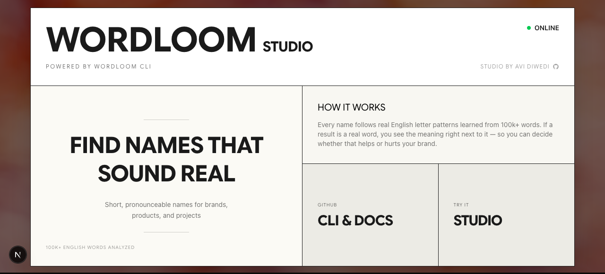
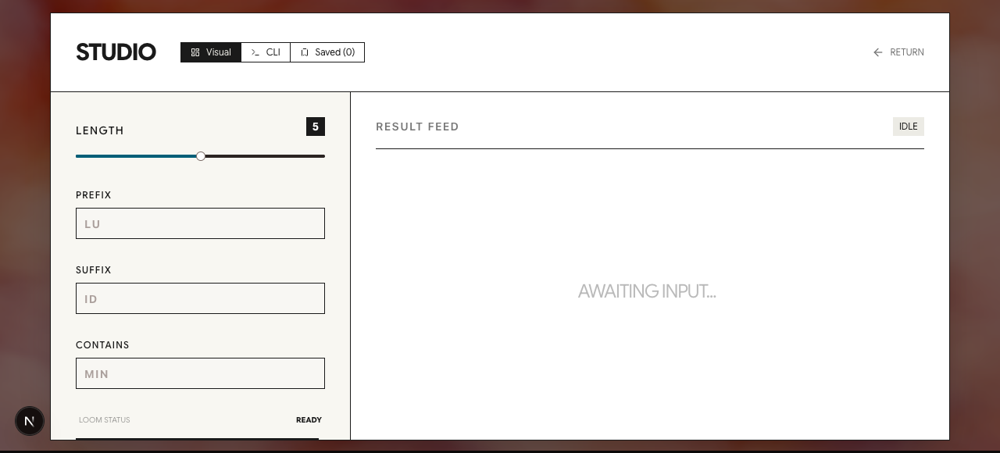

# Wordloom Studio

**A web-based studio for generating short, pronounceable names — powered by [Wordloom CLI](https://github.com/nrjdalal/wordloom).**

By [Avi Diwedi](https://github.com/whoavidwivedi)



## What is Wordloom Studio?

Wordloom Studio is an interactive web application that puts the power of Wordloom's name generation engine into a visual interface. Instead of running CLI commands, you configure constraints through sliders and inputs, and see results instantly.



### Features

- **Visual controls** — adjust name length, prefix, suffix, and substring filters with sliders and inputs
- **Instant results** — names generate in real-time as you tweak parameters
- **Dictionary meanings** — real words are highlighted with their definitions from WordNet
- **Bookmarks** — save and manage your favorite name candidates
- **CLI mode** — toggle to a terminal-style interface if you prefer typing commands
- **Alphabetical navigation** — jump through results by letter
- **Dark mode** — press "d" to toggle

### How it works

Every name follows real English letter patterns learned from 100k+ words via [CMUdict](https://github.com/cmusphinx/cmudict). If a result is a real word, you see the meaning right next to it — so you can decide whether that helps or hurts your brand.

The generation engine is the same one that powers the [Wordloom CLI](https://github.com/nrjdalal/wordloom) — no API calls, everything runs server-side via Next.js server actions.

## Getting started

```bash
git clone https://github.com/whoavidwivedi/wordloom-studio.git
cd wordloom-studio
bun install
bun run dev:web
```

Open [http://localhost:3000](http://localhost:3000) to use the Studio.

## Tech stack

- **Framework** — Next.js 16, React 19, TypeScript
- **Styling** — Tailwind CSS 4, shadcn/ui components
- **Animation** — Motion, Vanta.js (WebGL backgrounds)
- **Build** — Turborepo, Bun, tsdown
- **Code quality** — oxlint, oxfmt, lefthook, commitlint

## Wordloom CLI

For terminal usage, check out the [Wordloom CLI](https://github.com/nrjdalal/wordloom):

```sh
npx wordloom --length 6 --prefix abs
```

## License

MIT
